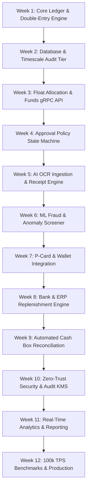

# PETTYFLOW: AI EXECUTION ROADMAP (12-WEEK DELIVERABLE SPECIFICATION)
**Architectural Blueprint & AI Code Generation Protocol**  
**Design Standard**: Jeff Dean Distributed Systems Engineering  
**Version**: 1.0.0  
**Target Repository**: `pettyflow`

---

## SECTION 0: EXECUTIVE SYSTEM PRINCIPLES & JEFF DEAN INVARIANTS

Every line of code and architectural artifact produced by AI execution agents MUST adhere to these fundamental engineering invariants:

1. **Strict Double-Entry Invariant**: \(\sum \text{Debits} \equiv \sum \text{Credits}\) for every transaction UUID. Zero floating-point rounding errors. All monetary balances MUST use 64-bit integer fixed-point arithmetic (scaled by \(10^4\), e.g., $100.25 = 1,002,500$ base units) or arbitrary-precision decimal strings (`DECIMAL(18,4)`).
2. **Sub-Millisecond Core Latency Budget**:
   - Ledger Entry Validation: \(< 150 \ \mu\text{s}\)
   - Immutable Append-Only Ledger Commit: \(< 2.0 \ \text{ms}\) (p99)
   - In-Memory Cache Balance Lookup: \(< 50 \ \mu\text{s}\) (p99)
   - End-to-End API Read Latency: \(< 10 \ \text{ms}\) (p99)
3. **Cryptographic Chain Immutability**: Each transaction record MUST compute `hash_n = HMAC-SHA256(hash_{n-1} || tx_payload || timestamp)`. Audit log integrity verification MUST process at \(\ge 1.0 \ \text{GB/s}\) using vector instructions.
4. **Lock-Free Concurrency & Optimistic Execution**: Hot-account contention MUST be mitigated using lock-free ring buffers (Disruptor pattern) and optimistic concurrency tokens (`version_id`). Row locks on primary balance tables are strictly prohibited.
5. **Zero-Trust & Multi-Tenancy Scoping**: Every database query, cache key, and event bus message MUST be explicitly scoped by `tenant_id` at the execution context level.

---

## SECTION 1: AI AGENT EXECUTION RULES & DEFINITION OF DONE (DoD)

### 1.1 AI Execution Rules
- **Rule A (Deterministic Builds)**: All week deliverables must include standard unit tests (`pytest` / `jest` / `go test`) achieving \(\ge 90\%\) line coverage and \(100\%\) branch coverage on core financial logic.
- **Rule B (No Placeholders)**: Mock data or hardcoded stubs in production paths are forbidden. Mocking is restricted exclusively to external third-party API adapters (e.g., Plaid/SAP external endpoints in local test suites).
- **Rule C (ADR Requirements)**: Any structural modification to ledger schema, state machines, or authentication protocols MUST generate a corresponding Architectural Decision Record in `docs/adr/ADR-XXX.md`.

### 1.2 Definition of Done (DoD) for Each Deliverable Week
- [ ] Code implemented in module directory following domain-driven design (`/src/domain`, `/src/infrastructure`, `/src/api`).
- [ ] Automated unit, integration, and stress tests passing cleanly.
- [ ] Swagger / OpenAPI 3.0 specs and protobuf schemas updated.
- [ ] Database migration scripts (`.sql` / `golang-migrate` / `flyway`) versioned and verified.
- [ ] Benchmark log proving compliance with latency and memory constraints.

---

## SECTION 2: 12-WEEK AI EXECUTION ROADMAP



---

### WEEK 1: Core Domain Engine & Double-Entry Cryptographic Ledger
- **Primary Objective**: Build the immutable, double-entry financial core engine with cryptographic hash chaining.
- **Exact File Deliverables**:
  - `src/domain/ledger/entry.py` (or `.go`): Core double-entry balance validation engine.
  - `src/domain/ledger/hash_chain.py`: SHA-256 tamper-evident chain verification module.
  - `tests/unit/test_double_entry.py`: Mathematical invariant suite (1,000 randomized balanced postings).
- **Technical Specification**:
  - Implement 5 account types: `ASSET`, `LIABILITY`, `EQUITY`, `EXPENSE`, `REVENUE`.
  - Enforce constraint: \(\sum \text{Debits} - \sum \text{Credits} = 0\). Reject any unbalanced batch with `UnbalancedLedgerEntryException`.
  - Calculate running HMAC-SHA256 signature per tenant.
- **Acceptance Criteria**:
  - 10,000 double-entry transactions processed in memory in \(< 500 \ \text{ms}\).
  - Chain tampering correctly detected when any historical transaction payload is modified by 1 bit.

---

### WEEK 2: High-Performance Database Schema & Cache Tier
- **Primary Objective**: Design relational PostgreSQL tables, append-only TimescaleDB partition tables, and Redis cache layer.
- **Exact File Deliverables**:
  - `migrations/V001__init_pettyflow_schema.sql`: DDL for tenants, funds, accounts, postings, and audit_trail.
  - `src/infrastructure/cache/redis_balance_cache.py`: Cache-aside balance aggregator with optimistic locking.
  - `src/infrastructure/db/connection.py`: High-concurrency connection pool setup (pgx/SQLAlchemy async).
- **Technical Specification**:
  - Partition `postings` table by `tenant_id` and monthly `created_at` ranges.
  - Indexing: Compound index on `(tenant_id, account_id, created_at DESC)`.
  - Write balance updates via Redis LUA script for sub-100 microsecond atomic increments.
- **Acceptance Criteria**:
  - Successful migration rollout and rollback verification.
  - Concurrent DB write benchmark achieves \(\ge 5,000 \ \text{writes/sec}\) on local instance.

---

### WEEK 3: Petty Cash Fund & Float Allocation API (gRPC & REST)
- **Primary Objective**: Construct high-throughput APIs for requesting, allocating, and tracking custodian petty cash floats.
- **Exact File Deliverables**:
  - `proto/pettyflow/v1/float_service.proto`: gRPC service interfaces for Float Management.
  - `src/api/grpc/float_handler.py`: gRPC handler implementations.
  - `src/api/rest/float_router.py`: FastAPI / REST OpenAPI wrapper endpoints.
- **Technical Specification**:
  - Endpoints: `CreateFund`, `AllocateFloat`, `IssueDisbursement`, `GetCustodianBalance`.
  - Input validation: Strict regex on currencies (ISO-4217), UUIDv4 tenant IDs, non-negative amounts.
- **Acceptance Criteria**:
  - gRPC service passes end-to-end integration test with protobuf client.
  - REST endpoints auto-generate valid OpenAPI 3.0 specification at `/docs`.

---

### WEEK 4: Multi-Tier Dynamic Approval Workflow Engine
- **Primary Objective**: Build a state-machine driven approval engine with configurable enterprise policy rules.
- **Exact File Deliverables**:
  - `src/domain/workflow/state_machine.py`: Deterministic state transitions (`DRAFT` \(\rightarrow\) `PENDING` \(\rightarrow\) `APPROVED` / `REJECTED` \(\rightarrow\) `DISBURSED`).
  - `src/domain/workflow/policy_evaluator.py`: Rule engine for threshold-based approval chains (e.g., \(<\$50\) Auto-approve, \(\$50-\$500\) Manager Approval, \(>\$500\) Finance Director).
  - `tests/unit/test_approval_workflow.py`: Comprehensive edge-case state matrix tests.
- **Acceptance Criteria**:
  - Rejection of invalid state transitions (e.g., direct jump from `DRAFT` to `DISBURSED`).
  - Evaluation of complex policy rules executing in \(< 1.5 \ \text{ms}\).

---

### WEEK 5: AI-Powered OCR Ingestion & Receipt Extraction Pipeline
- **Primary Objective**: Build real-time receipt image processing pipeline converting photos into structured json expenditure proofs.
- **Exact File Deliverables**:
  - `src/services/ai/ocr_processor.py`: TrOCR / Vision-Language Model interface for receipt parsing.
  - `src/services/ai/preprocessor.py`: Image deskew, noise reduction, and contrast optimization module.
  - `src/api/rest/receipt_router.py`: Async multipart upload endpoint handling JPEG/PNG/PDF.
- **Technical Specification**:
  - Extract: Merchant Name, Tax ID / VAT Number, Date/Time, Itemized Line Items, Subtotal, Tax, Tip, Total.
  - Perform mathematical validation: \(\text{Subtotal} + \text{Tax} + \text{Tip} \equiv \text{Total}\).
- **Acceptance Criteria**:
  - Accuracy \(\ge 95\%\) field extraction on standardized receipt dataset.
  - End-to-end receipt parsing pipeline completes in \(< 1.8 \ \text{seconds}\) per image.

---

### WEEK 6: Machine Learning Fraud Screening & Anomaly Engine
- **Primary Objective**: Implement automated fraud screening algorithms to block receipt duplication, altered totals, and split transactions.
- **Exact File Deliverables**:
  - `src/services/fraud/perceptual_hash.py`: Image similarity detection via dHash/pHash algorithm.
  - `src/services/fraud/split_tx_detector.py`: Sliding-window temporal detector for threshold bypassing.
  - `src/services/fraud/risk_scorer.py`: Composite risk score engine (0 to 100).
- **Technical Specification**:
  - Split Transaction Detection: Flag \(\ge 2\) transactions by same custodian within 24 hours whose combined sum exceeds approval thresholds.
  - Duplicate Receipt Check: Perceptual image distance \(\le 5\) bits triggers automatic duplicate flag.
- **Acceptance Criteria**:
  - Synthetic fraud test suite: \(100\%\) detection of duplicate images and split amounts.
  - False positive rate under \(2.0\%\) on control transaction samples.

---

### WEEK 7: Physical & Digital Wallet Float Integration
- **Primary Objective**: Connect PettyFlow with digital wallets and virtual P-Cards for instant float disbursement.
- **Exact File Deliverables**:
  - `src/infrastructure/adapters/card_issuer.py`: Virtual card creation adapter (Stripe Issuing / Marqeta API).
  - `src/infrastructure/adapters/mobile_money.py`: Mobile disbursement adapter (M-Pesa / ACH / Venmo Enterprise).
  - `src/domain/wallet/disbursement_manager.py`: Secure tokenized float provider.
- **Acceptance Criteria**:
  - Virtual card creation flow completes within \(< 800 \ \text{ms}\) webhook response target.
  - Webhook idempotency layer prevents double-issuance on network retries.

---

### WEEK 8: Enterprise ERP & Bank Replenishment Integration
- **Primary Objective**: Develop automated sync connectors for major corporate ERPs and bank APIs to automate petty cash replenishment.
- **Exact File Deliverables**:
  - `src/infrastructure/erp/sap_adapter.py`: SAP S/4HANA OData API integration module.
  - `src/infrastructure/erp/netsuite_adapter.py`: NetSuite SuiteTalk REST/SOAP integration connector.
  - `src/infrastructure/banking/plaid_adapter.py`: Plaid / Bank ACH transfer manager.
- **Acceptance Criteria**:
  - Bidirectional journal posting sync verified with mock SAP/NetSuite environments.
  - Full automated bank transfer payload built according to ISO 20022 `pain.001` XML standards.

---

### WEEK 9: Automated Cash Box & Bank Reconciliation Module
- **Primary Objective**: Construct daily physical cash count reconciliation and bank statement matching engine.
- **Exact File Deliverables**:
  - `src/domain/reconciliation/matcher.py`: 3-way reconciliation engine (Cash Count vs System Float vs Bank Feed).
  - `src/domain/reconciliation/variance_analyzer.py`: Variance calculator and auto-adjustment ledger generator.
  - `src/api/rest/reconciliation_router.py`: Daily closing & sign-off endpoints.
- **Acceptance Criteria**:
  - System automatically identifies un-reconciled variances down to the exact cent.
  - Generates balanced adjustment entries for approved variances within policy limits.

---

### WEEK 10: Multi-Tenant Zero-Trust Security, KMS & Audit Framework
- **Primary Objective**: Secure system with envelope encryption, enterprise SSO (OIDC/SAML2), and SOC2 compliant audit logging.
- **Exact File Deliverables**:
  - `src/infrastructure/security/kms_vault.py`: AWS KMS / HashiCorp Vault field-level encryption for sensitive PII.
  - `src/infrastructure/security/jwt_verifier.py`: Zero-trust JWT/OAuth2 validator with tenant isolation claims.
  - `src/infrastructure/audit/tamper_log.py`: WORM (Write-Once-Read-Many) audit logging adapter.
- **Acceptance Criteria**:
  - Field-level encryption verifies PII stored in DB is unreadable without KMS key access.
  - Penetration test script fails to bypass tenant context isolation boundaries.

---

### WEEK 11: Real-Time Financial Analytics, Multi-Currency & Reporting Engine
- **Primary Objective**: Build multi-currency conversion engine and real-time executive petty cash financial analytics dashboards.
- **Exact File Deliverables**:
  - `src/domain/currency/exchange_rates.py`: Real-time ECB/Fixer exchange rate sync and historical revaluation engine.
  - `src/services/analytics/spend_aggregator.py`: Real-time spend breakdown by department, location, and expense category.
  - `src/api/rest/reports_router.py`: PDF and CSV financial statement exporter.
- **Acceptance Criteria**:
  - Multi-currency transaction converted to tenant base currency with exact historical spot rates.
  - Analytics dashboard query response time \(< 150 \ \text{ms}\) across 1,000,000 transaction rows.

---

### WEEK 12: 100k TPS Benchmarks, Chaos Testing & Production Readiness
- **Primary Objective**: Perform extreme load testing, fault injection, container hardening, and final production rollout.
- **Exact File Deliverables**:
  - `benchmarks/locustfile.py`: Distributed load testing suite targeting 100k TPS float queries.
  - `deploy/k8s/helm/pettyflow/`: Production Kubernetes Helm charts with HPA, PodDisruptionBudgets, and ingress rules.
  - `docs/runbooks/disaster_recovery.md`: Step-by-step failover and zero-data-loss recovery manual.
- **Acceptance Criteria**:
  - System maintains stable p99 latency \(< 10 \ \text{ms}\) under 100,000 requests/sec synthetic traffic.
  - Zero transaction loss during simulated database primary failover.

---

## SECTION 3: ARCHITECTURAL DECISION RECORD (ADR) REQUIREMENTS

Every AI execution step that alters system structure MUST document the change using the following mandatory ADR schema in `docs/adr/ADR-XXX.md`:

```markdown
# ADR-XXX: [Short Title]

## Context & Problem Statement
[Describe the technical driver, constraint, or Jeff Dean latency threshold requirement.]

## Decision Drivers
- Latency threshold: [e.g., < 2ms commit]
- Security constraint: [e.g., Zero-Trust Tenant Isolation]
- Financial accuracy: [e.g., Exact 64-bit integer arithmetic]

## Considered Options
1. [Option 1]
2. [Option 2]

## Decision Outcome
Chosen Option: [Option X], because [Rationale].

## Consequences
- Positive: [Benefits]
- Negative: [Trade-offs or mitigation strategies]
```

---
**End of AI Execution Roadmap (`PETTYFLOW_AI_ROADMAP.md`)**
