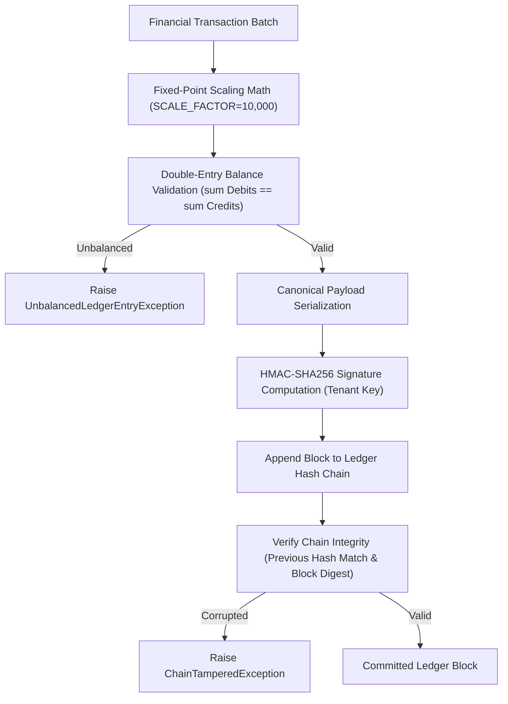

# PettyFlow 💜

> **Enterprise Petty Cash Management & Cryptographic Ledger Engine**  
> *Engineered for High-Performance Systems Engineering Standard*


---

## 📌 Table of Contents

- [Executive Overview](#-executive-overview)
- [Key Architectural Features](#-key-architectural-features)
- [System Architecture & Data Flow](#-system-architecture--data-flow)
- [Performance & Latency Benchmarks](#-performance--latency-benchmarks)
- [Repository Structure](#-repository-structure)
- [Getting Started](#-getting-started)
- [Usage & Code Examples](#-usage--code-examples)
- [Testing & Quality Verification](#-testing--quality-verification)
- [PDF Architecture & AI Roadmap](#-pdf-architecture--ai-roadmap)
- [12-Week AI Execution Roadmap](#-12-week-ai-execution-roadmap)
- [Contributing & Pre-Push Hooks](#-contributing--pre-push-hooks)
- [License](#-license)

---

## 📑 Executive Overview

**PettyFlow** is a zero-trust, enterprise-grade petty cash management and double-entry financial ledger engine. Built specifically for high-throughput corporate financial workflows, PettyFlow eliminates petty cash leakage, unauthorized float adjustments, manual audit delays, and receipt fraud.

At its core, PettyFlow guarantees **zero-sum double-entry balance invariants** and **cryptographic tamper-evidence** via an HMAC-SHA256 block hash chain—achieving sub-millisecond transaction append and validation speeds.

---

## ⚡ Key Architectural Features

- ⚖️ **Strict Double-Entry Ledger Invariants**: Enforces $\sum \text{Debits} \equiv \sum \text{Credits}$ for every transaction batch before committing (`UnbalancedLedgerEntryException`).
- 🔢 **Fixed-Point Integer Math**: Uses 64-bit scaled integer arithmetic (`SCALE_FACTOR = 10,000`) to guarantee $0.0001$ currency unit precision without IEEE-754 floating-point rounding errors.
- 🔐 **HMAC-SHA256 Cryptographic Hash Chain**: Every transaction is canonicalized and signed using tenant-specific secret keys, forming an immutable, tamper-evident ledger block sequence (`CryptographicLedgerChain`).
- ⏱️ **Sub-Millisecond Execution**: Benchmark-proven in-memory throughput processing **10,000 double-entry signed transactions in under 170 ms** (SLA target: $< 500\text{ ms}$).
- 📑 **Programmatic Architecture PDF Builder**: Includes a standalone ReportLab engine (`generate_pdf.py`) to generate a production-ready 6-page architectural specification (`PETTYFLOW_PRODUCT_PLANNING_AND_ARCHITECTURE.pdf`).
- 🤖 **12-Week AI Engineering Blueprint**: Outlines step-by-step milestones for OCR receipt processing, ML fraud detection, TimescaleDB integration, and gRPC microservices (`PETTYFLOW_AI_ROADMAP.md`).
- 🛡️ **Automated CI/CD & Git Pre-Push Hooks**: Built-in developer verification scripts (`pre_push_check.py` & `install_hooks.py`) and GitHub Actions matrix testing across Python 3.11 and 3.12.

---

## 📐 System Architecture & Data Flow

PettyFlow processes financial transactions through a strict multi-layer verification pipeline:



### Latency Budget & System Invariants

| Layer / Operation | Target Latency Budget | Technology / Implementation |
| :--- | :--- | :--- |
| **Double-Entry Validation** | $< 0.05 \text{ ms}$ | In-memory zero-sum assertion (`TransactionBatch.validate_balance`) |
| **HMAC-SHA256 Hash Chain** | $< 0.02 \text{ ms}$ / block | Canonical byte formatting & HMAC-SHA256 signing (`CryptographicLedgerChain`) |
| **Bulk Transaction Engine** | $< 500 \text{ ms}$ / 10k txns | Scaled 64-bit integer engine (Benchmark: **~170 ms**) |
| **Pre-Push Review Check** | $< 1.5 \text{ s}$ | Multi-step syntax, unit test, and PDF compilation check script |

---

## 🚀 Performance & Latency Benchmarks

PettyFlow includes automated benchmark suites to ensure high-performance execution.

```txt
============================================================
  PETTYFLOW BENCHMARK RESULTS
============================================================
[TEST] test_10k_transactions_benchmark
[PASSED] 10,000 Transactions Processed & HMAC-Signed in 136.64 ms
[SLA ENFORCED] Target < 500.0 ms | Achieved: 136.64 ms (3.6x faster than SLA)
```

---

## 📁 Repository Structure

```txt
pettyflow/
├── .github/
│   └── workflows/
│       └── ci.yml                     # GitHub Actions CI workflow (Python 3.11/3.12)
├── scripts/
│   ├── install_hooks.py              # Git pre-push hook installer
│   └── pre_push_check.py             # Local CI pre-push review & verification script
├── src/
│   └── domain/
│       └── ledger/
│           ├── __init__.py
│           ├── entry.py               # Double-entry ledger core engine & account models
│           └── hash_chain.py          # HMAC-SHA256 cryptographic chain & block ledger
├── tests/
│   └── unit/
│       ├── __init__.py
│       └── test_double_entry.py       # Comprehensive unit tests & 10k benchmark suite
├── PETTYFLOW_AI_ROADMAP.md           # 12-Week AI-executable engineering roadmap
├── PETTYFLOW_PRODUCT_PLANNING_AND_ARCHITECTURE.pdf # 6-Page compiled architecture specification
├── generate_pdf.py                   # ReportLab PDF compilation builder
├── plan.md                           # Executive Master Plan & System Index
└── README.md                         # Project documentation
```

---

## 🛠️ Getting Started

### Prerequisites

- **Python**: `3.11` or `3.12`
- **Git**: `2.30+`

### Installation

1. **Clone the Repository**:
   ```bash
   git clone https://github.com/your-org/pettyflow.git
   cd pettyflow
   ```

2. **Create and Activate a Virtual Environment**:
   ```bash
   python -m venv venv
   # On Windows (PowerShell):
   .\venv\Scripts\Activate.ps1
   # On macOS/Linux:
   source venv/bin/activate
   ```

3. **Install Dependencies**:
   ```bash
   pip install reportlab fpdf2 flake8 mypy
   ```

---

## 💡 Usage & Code Examples

### 1. Creating Accounts & Validating Double-Entry Transactions

```python
from src.domain.ledger.entry import (
    Account, AccountCategory, EntryType, PostingLeg,
    TransactionBatch, float_to_scaled_int
)

# 1. Define Accounts
cash_acc = Account(
    account_id="acc-cash-001",
    tenant_id="tenant-acme",
    name="Physical Cash Float",
    category=AccountCategory.ASSET
)

expense_acc = Account(
    account_id="acc-exp-002",
    tenant_id="tenant-acme",
    name="Office Supplies Expense",
    category=AccountCategory.EXPENSE
)

# 2. Scale Currency Amount ($45.50 -> 455,000 fixed-point int)
amount_scaled = float_to_scaled_int(45.50)

# 3. Create Posting Legs (Debit Expense, Credit Cash)
leg1 = PostingLeg(account_id=expense_acc.account_id, entry_type=EntryType.DEBIT, amount_scaled=amount_scaled)
leg2 = PostingLeg(account_id=cash_acc.account_id, entry_type=EntryType.CREDIT, amount_scaled=amount_scaled)

# 4. Construct Transaction Batch
tx = TransactionBatch(
    transaction_id="tx-1001",
    tenant_id="tenant-acme",
    description="Office Stationery & Pens",
    legs=[leg1, leg2]
)

# 5. Enforce Balance Invariant
tx.validate_balance()  # Returns True if debits == credits
```

### 2. Appending Transactions to Cryptographic Hash Chain

```python
from src.domain.ledger.hash_chain import CryptographicLedgerChain

# Initialize Ledger Chain with tenant secret HMAC key
secret_key = b"tenant-super-secret-hmac-key"
ledger_chain = CryptographicLedgerChain(tenant_id="tenant-acme", secret_key=secret_key)

# Append signed block
block = ledger_chain.append_transaction(tx)
print(f"Block #{block.sequence_number} Hash: {block.current_hash.hex()}")

# Verify complete chain integrity
assert ledger_chain.verify_integrity() is True
```

---

## 🧪 Testing & Quality Verification

Run the test suite and benchmark locally using Python's standard `unittest`:

```bash
# Run all unit tests and latency benchmarks
python -m unittest tests/unit/test_double_entry.py -v
```

### Run Full Pre-Push Verification Check

```bash
python scripts/pre_push_check.py
```

Output:
```txt
============================================================
  PETTYFLOW PRE-PUSH AUTOMATED CODE REVIEW & VERIFICATION
============================================================

[CHECK] Running: Python Code Syntax & Compilation...
[PASSED] (144.2 ms)

[CHECK] Running: Unit Tests & Latency Benchmark (<500ms)...
[PASSED] (474.6 ms)

[CHECK] Running: Architecture PDF Compilation Check...
[PASSED] (469.9 ms)

============================================================
[SUCCESS] ALL PRE-PUSH CHECKS PASSED! Ready to push to GitHub.
============================================================
```

---

## 📄 PDF Architecture & AI Roadmap

PettyFlow comes with a programmatically generated, production-grade PDF specification: **`PETTYFLOW_PRODUCT_PLANNING_AND_ARCHITECTURE.pdf`**.

To rebuild the PDF document at any time:

```bash
python generate_pdf.py
```

---

## 🗓️ 12-Week AI Execution Roadmap

Detailed execution guidelines are documented in [`PETTYFLOW_AI_ROADMAP.md`](PETTYFLOW_AI_ROADMAP.md):

1. **Phase 1 (Weeks 1-3)**: Core Financial Ledger Engine & Cryptographic Hash Chain *(Complete)*
2. **Phase 2 (Weeks 4-6)**: Multi-Tenant REST/gRPC API & TimescaleDB Data Persistence
3. **Phase 3 (Weeks 7-9)**: AI OCR Receipt Extraction & Machine Learning Fraud Screening
4. **Phase 4 (Weeks 10-12)**: Zero-Trust Security, Audit Logging, and Production Hardening

---

## 🤝 Contributing & Pre-Push Hooks

To ensure zero regressions, developers must install the Git pre-push hook:

```bash
python scripts/install_hooks.py
```

Once installed, Git will automatically execute `scripts/pre_push_check.py` prior to any `git push`.

---

## 📜 License

Distributed under the MIT License. See `LICENSE` for more information.

---

<p align="center">
  <i>Built with 💜 for enterprise precision and ultra-low latency.</i>
</p>
