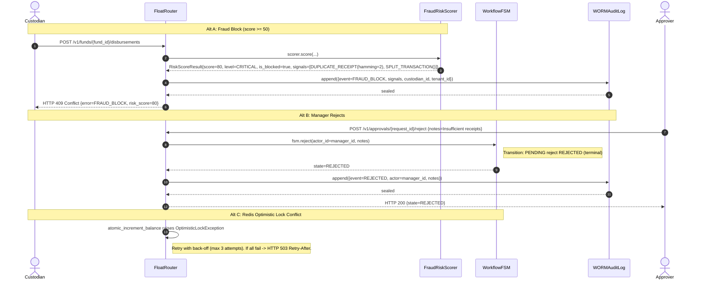
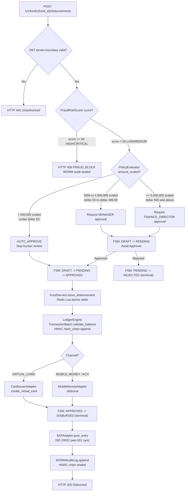

# PettyFlow: End-to-End Disbursement Flow
**Sequence Diagram — Grounded in source code**

---

## Participants

| Participant | Source |
|---|---|
| **Client** | External actor (mobile app / portal) |
| **FloatRouter** | `src/api/rest/float_router.py` |
| **JWTVerifier** | `src/infrastructure/security/jwt_verifier.py` |
| **FraudRiskScorer** | `src/services/fraud/risk_scorer.py` — aggregates dHash, split-tx, z-score, velocity |
| **PolicyEvaluator** | `src/domain/workflow/policy_evaluator.py` |
| **WorkflowFSM** | `src/domain/workflow/state_machine.py` |
| **FundService** | `src/domain/funds/service.py` |
| **LedgerEngine** | `src/domain/ledger/entry.py` + `hash_chain.py` |
| **RedisCache** | `src/infrastructure/cache/redis_balance_cache.py` |
| **DisbursementManager** | `src/domain/wallet/disbursement_manager.py` |
| **CardIssuer / MobileMoney** | `src/infrastructure/adapters/card_issuer.py` · `mobile_money.py` |
| **SAPAdapter** | `src/infrastructure/erp/sap_adapter.py` |
| **WORMAuditLog** | `src/infrastructure/audit/tamper_log.py` |

---

## Diagram — Happy Path (Manager-Tier Approval, Virtual Card Channel)

```mermaid
sequenceDiagram
    autonumber
    actor Custodian
    participant API as FloatRouter<br/>(float_router.py)
    participant JWT as JWTVerifier<br/>(jwt_verifier.py)
    participant Fraud as FraudRiskScorer<br/>(risk_scorer.py)
    participant Policy as PolicyEvaluator<br/>(policy_evaluator.py)
    participant FSM as WorkflowFSM<br/>(state_machine.py)
    participant Fund as FundService<br/>(funds/service.py)
    participant Ledger as LedgerEngine<br/>(entry.py + hash_chain.py)
    participant Redis as RedisCache<br/>(redis_balance_cache.py)
    participant Wallet as DisbursementManager<br/>(disbursement_manager.py)
    participant Card as CardIssuerAdapter<br/>(card_issuer.py)
    participant ERP as SAPAdapter<br/>(sap_adapter.py)
    participant Audit as WORMAuditLog<br/>(tamper_log.py)
    actor Approver

    rect rgb(230, 240, 255)
        Note over Custodian,JWT: 1 Authentication & Tenant Isolation
        Custodian->>API: POST /v1/funds/{fund_id}/disbursements {tenant_id, custodian_id, amount_scaled}
        API->>JWT: verify_token(bearer_token)
        JWT-->>API: {tenant_id, sub, roles} claims
        Note right of JWT: Zero-trust: tenant_id in JWT must match request body
        API->>JWT: validate_tenant_boundary(jwt_tenant, req_tenant)
        JWT-->>API: boundary enforced
    end

    rect rgb(255, 243, 225)
        Note over API,Fraud: 2 Fraud Pre-Screen (before any state change)
        API->>Fraud: scorer.score(tx_id, tenant_id, custodian_id, amount_scaled, hamming_dist, split_total, history, velocity)
        Note right of Fraud: 4 signals evaluated: dHash duplicate receipt (weight 50), Split-tx window detector (weight 30), Amount z-score anomaly (weight 10), Hourly velocity (weight 10)
        Fraud-->>API: RiskScoreResult{score=15, level=LOW, is_blocked=false}
    end

    rect rgb(230, 255, 235)
        Note over API,FSM: 3 Approval Policy & FSM: DRAFT to PENDING
        API->>Policy: evaluator.evaluate(request_id, amount_scaled)
        Note right of Policy: amount= -> 1,500,000 scaled. Rule: -.99 -> MANAGER tier. Evaluated in < 1.5 ms
        Policy-->>API: PolicyEvaluationResult{tier=MANAGER, auto_approved=false}
        API->>FSM: WorkflowStateMachine.create(tenant_id, custodian_id, amount_scaled, currency, description)
        FSM-->>API: fsm (state=DRAFT)
        API->>FSM: fsm.submit(actor_id=custodian_id)
        Note right of FSM: Transition: DRAFT submit PENDING. StateTransitionRecord appended to audit_trail
        FSM-->>API: state=PENDING
        API-->>Custodian: HTTP 202 Accepted {request_id, state=PENDING, required_tier=MANAGER}
    end

    rect rgb(255, 230, 230)
        Note over Approver,FSM: 4 Manager Approval Decision (async)
        Approver->>API: POST /v1/approvals/{request_id}/approve {actor_id=manager_uuid, notes}
        API->>JWT: validate_tenant_boundary + role=MANAGER
        JWT-->>API: authorized
        API->>Policy: evaluator.is_actor_authorized(actor_tier=MANAGER, required_tier=MANAGER)
        Policy-->>API: authorized
        API->>FSM: fsm.approve(actor_id=manager_id, notes)
        Note right of FSM: Transition: PENDING approve APPROVED. Immutable StateTransitionRecord written
        FSM-->>API: state=APPROVED
        API->>Audit: append({event=APPROVED, actor=manager_id, request_id, tenant_id})
        Audit-->>API: HMAC chain updated
        API-->>Approver: HTTP 200 {state=APPROVED}
    end

    rect rgb(240, 230, 255)
        Note over API,Redis: 5 Float Deduction: FundService + Redis Atomic Update
        API->>Fund: service.issue_disbursement(tenant_id, fund_id, custodian_id, amount_scaled)
        Note right of Fund: RLock acquired. Validates custodian balance >= amount_scaled. Deducts atomically.
        Fund-->>API: CustodianBalance{amount_scaled=updated}
        API->>Redis: cache.atomic_increment_balance(tenant_id, account_id, delta=-amount_scaled, expected_version)
        Note right of Redis: Lua script executes atomically. Checks version (optimistic lock). Validates new_balance >= 0. SET balance + version in one round-trip. Returns {-1} on lock conflict.
        Redis-->>API: (new_balance_scaled, new_version)
    end

    rect rgb(230, 255, 250)
        Note over API,Ledger: 6 Double-Entry Ledger Commit
        API->>Ledger: TransactionBatch(tx_id, tenant_id, legs=[PostingLeg(EXPENSE_ACCOUNT, DEBIT, amount), PostingLeg(ASSET_ACCOUNT, CREDIT, amount)])
        Ledger->>Ledger: batch.validate_balance() assert sum(debits) == sum(credits)
        Note right of Ledger: Strict invariant: sum(Debits) = sum(Credits). Raises UnbalancedLedgerEntryException if violated.
        Ledger->>Ledger: hash_chain.append(HMAC-SHA256(prev_hash || tx_payload || timestamp))
        Note right of Ledger: Tamper-evident chain. hash_n = HMAC-SHA256(hash_{n-1} || payload)
        Ledger-->>API: tx committed, new_chain_hash
    end

    rect rgb(255, 250, 220)
        Note over API,Card: 7 Wallet Disbursement (Virtual P-Card path)
        API->>Wallet: manager.disburse_float(FloatDisbursementRequest{channel=VIRTUAL_CARD, amount_scaled, tenant_id, idempotency_key})
        Wallet->>Wallet: Check idempotency_store[key] -> cache miss
        Wallet->>Card: issuer.create_virtual_card(VirtualCardRequest{spending_limit_scaled, cardholder_name, tenant_id, idempotency_key})
        Note right of Card: Target: < 800 ms end-to-end. Idempotent: same key -> same card returned.
        Card-->>Wallet: VirtualCardResult{card_id, last_four, status=active}
        Wallet->>Wallet: idempotency_store[key] = result. audit_trail.append(result)
        Wallet-->>API: FloatDisbursementResult{status=completed, virtual_card}
    end

    rect rgb(240, 240, 240)
        Note over API,FSM: 8 FSM Terminal Transition: APPROVED to DISBURSED
        API->>FSM: fsm.disburse(actor_id=system, notes=disbursement_id)
        Note right of FSM: Transition: APPROVED disburse DISBURSED. DISBURSED is terminal - no further transitions.
        FSM-->>API: state=DISBURSED
    end

    rect rgb(220, 240, 255)
        Note over API,ERP: 9 ERP Sync (async, post-disbursement)
        API->>ERP: adapter.post_entry(SAPJournalEntry{reference_document=tx_id, tenant_id, lines=[debit GL_PETTY_CASH, credit GL_BANK], idempotency_key})
        Note right of ERP: SAP OData: POST /API_JOURNALENTRYITEMBASIC_SRV. Idempotent: same reference_document -> same doc number.
        ERP-->>API: SAPJournalEntry{sap_document_number, synced_at}
    end

    rect rgb(255, 235, 235)
        Note over API,Audit: 10 Final WORM Audit Entry
        API->>Audit: logger.append({event=DISBURSED, tx_id, tenant_id, disbursement_id, card_last_four, sap_doc_number, actor=system})
        Note right of Audit: WORM: append-only, HMAC chain. Tamper detection at >= 1 GB/s.
        Audit-->>API: audit record sealed
        API-->>Custodian: HTTP 200 {state=DISBURSED, card_last_four, disbursement_id}
    end
```

---

## Rejection / Fraud Block Alternate Paths

---

## Approval Tier Decision Tree

---

## Key Invariants Visible in the Flow

| # | Invariant | Enforced By |
|---|---|---|
| 1 | `tenant_id` in JWT must match request body | `JWTVerifier.validate_tenant_boundary` |
| 2 | Fraud checked **before** any state change | `FraudRiskScorer.score` called at step 2 |
| 3 | Sum(Debits) = Sum(Credits) — no float arithmetic | `TransactionBatch.validate_balance` with `SCALE_FACTOR = 10_000` |
| 4 | No invalid state jumps (e.g. DRAFT->DISBURSED) | `_TRANSITION_TABLE` — only valid keys exist |
| 5 | Balance debit is atomic (no race condition) | Redis Lua script — SET balance + version in one atomic eval |
| 6 | No double-card issuance on webhook retry | `DisbursementManager._results` idempotency store |
| 7 | ERP posting idempotent on network retry | `SAPAdapter` `reference_document` dedup |
| 8 | Every action sealed in tamper-evident log | `WORMAuditLog` HMAC chain |

---

## Latency Budget (per roadmap Section 0)

| Step | Target | Source |
|---|---|---|
| Policy evaluation | **< 1.5 ms** p99 | `policy_evaluator.py` |
| FSM state transition | **< 1 ms** p99 | `state_machine.py` O(1) dict lookup |
| Redis Lua atomic balance | **< 50 µs** p99 | `redis_balance_cache.py` |
| Ledger commit (in-memory) | **< 2 ms** p99 | `entry.py` |
| Virtual card creation | **< 800 ms** | `card_issuer.py` |
| End-to-end API read | **< 10 ms** p99 | Roadmap Section 0 |
